# Venture Funding with Deep Learning

You work as a risk management associate at Alphabet Soup, a venture capital firm. Alphabet Soup’s business team receives many funding applications from startups every day. This team has asked you to help them create a model that predicts whether applicants will be successful if funded by Alphabet Soup.

The business team has given you a CSV containing more than 34,000 organizations that have received funding from Alphabet Soup over the years. With your knowledge of machine learning and neural networks, you decide to use the features in the provided dataset to create a binary classifier model that will predict whether an applicant will become a successful business. The CSV file contains a variety of information about these businesses, including whether or not they ultimately became successful.

## Instructions

The steps for this challenge are broken out into the following sections:

* Prepare the data for use on a neural network model.

* Compile and evaluate a binary classification model using a neural network.

* Optimize the neural network model.

### Step 1: Prepare the Data for Use on a Neural Network Model

Using your knowledge of Pandas and scikit-learn’s `StandardScaler()`, preprocess the dataset so that you can use it to compile and evaluate the neural network model later.

Open the starter code file, and complete the following data preparation steps:

1. Read the `applicants_data.csv` file into a Pandas DataFrame. Review the DataFrame, looking for categorical variables that will need to be encoded, as well as columns that could eventually define your features and target variables.
    * Origional Dataset: 12 columns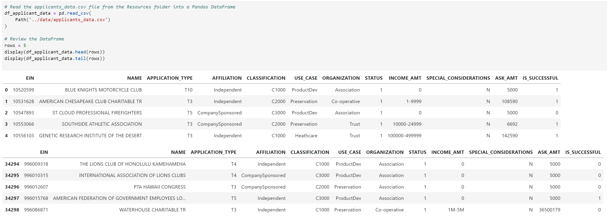  
    * Data Types: Objects are non numeric and can be encoded.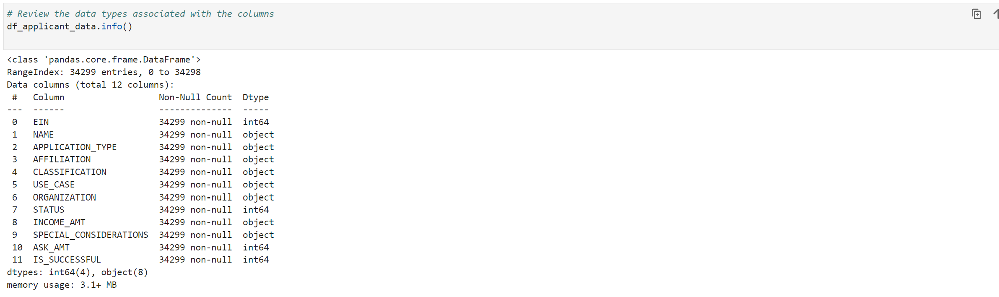  
&nbsp;  
   > **Note:** Additional analysis is presented in the Alterative Models below  
&nbsp;     
2. Drop the “EIN” (Employer Identification Number) and “NAME” columns from the DataFrame, because they are not relevant to the binary classification model.
    * Drop Columns: `EIN` and `NAME` are not needed.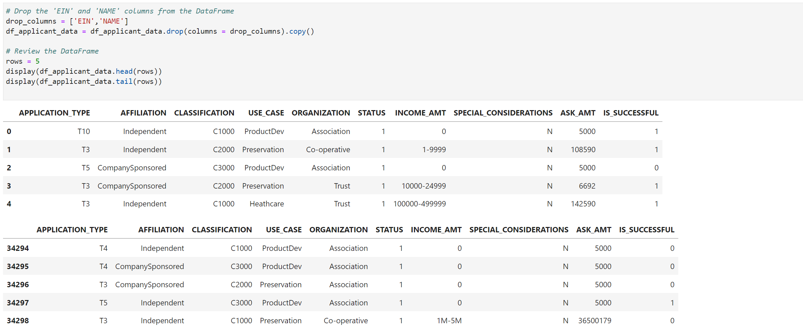  
&nbsp;  
3. Encode the dataset’s categorical variables using `OneHotEncoder`, and then place the encoded variables into a new DataFrame.
    * Catigorical Variables: To be encoded.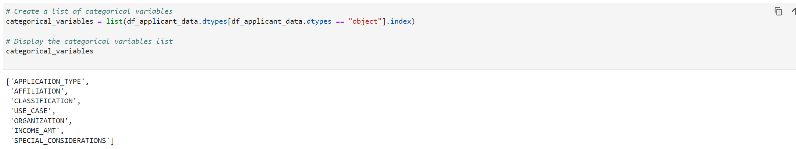  
    * One Hot Encoding: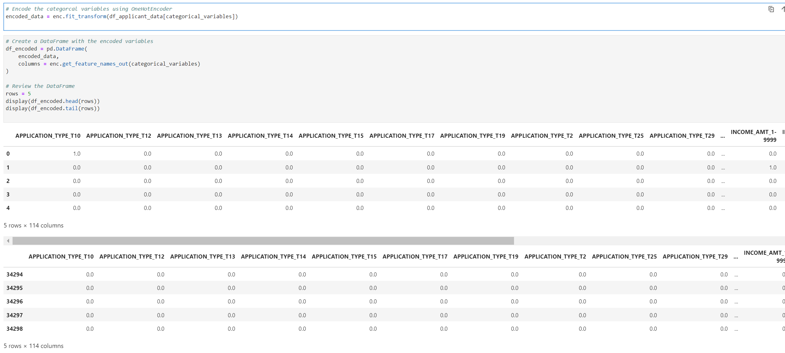  
&nbsp;  
4. Add the original DataFrame’s numerical variables to the DataFrame containing the encoded variables.
    * Concatinated Dataframe: Numeric and Caticegorical (Encoded) variables.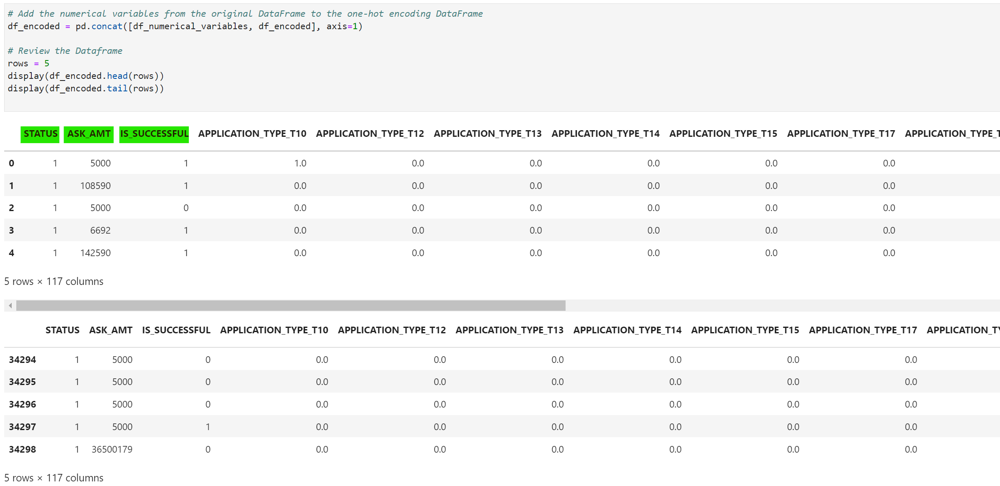  
&nbsp;  
    > **Note** To complete this step, you will employ the Pandas `concat()` function that was introduced earlier in this course.  
&nbsp;  
5. Using the preprocessed data, create the features (`X`) and target (`y`) datasets. The target dataset should be defined by the preprocessed DataFrame column “IS_SUCCESSFUL”. The remaining columns should define the features dataset.
    * Target(y) Variable: `IS_SUCCESSFUL`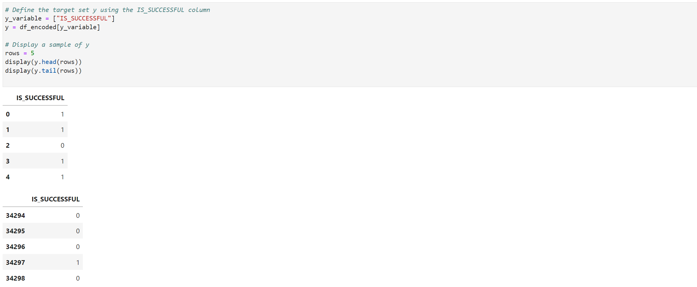
    * Features(x) Variables: 116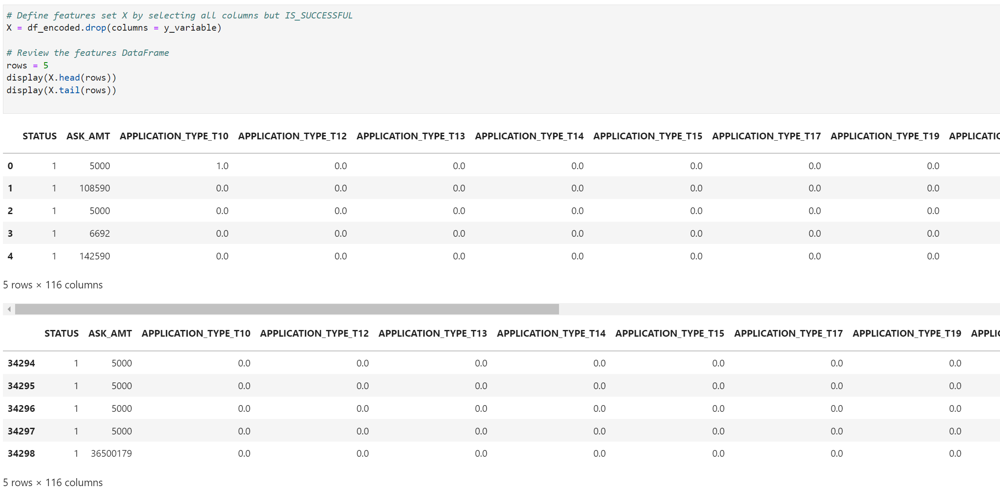   
&nbsp;    
6. Split the features and target sets into training and testing datasets.
    * Train Test Split: 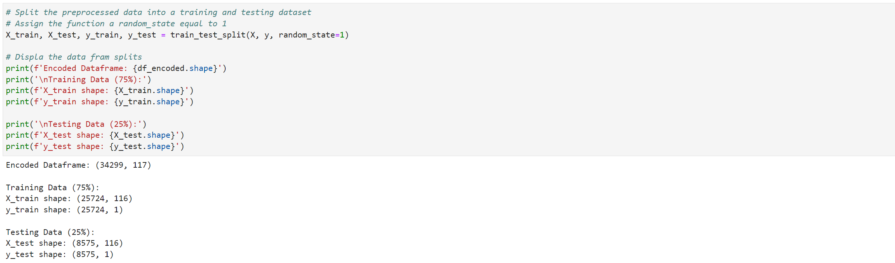  
&nbsp;    
7. Use scikit-learn's `StandardScaler` to scale the features data.
    * Standard Scaler: 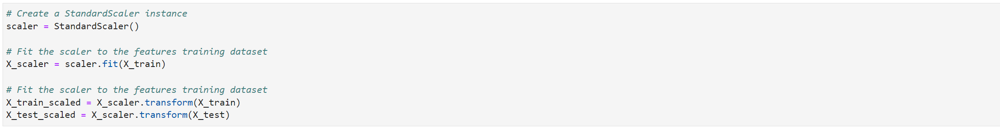  
&nbsp;  
&nbsp;  
### Step 2: Compile and Evaluate a Binary Classification Model Using a Neural Network

Use your knowledge of TensorFlow to design a binary classification deep neural network model. This model should use the dataset’s features to predict whether an Alphabet Soup&ndash;funded startup will be successful based on the features in the dataset. Consider the number of inputs before determining the number of layers that your model will contain or the number of neurons on each layer. Then, compile and fit your model. Finally, evaluate your binary classification model to calculate the model’s loss and accuracy.

To do so, complete the following steps:

1. Create a deep neural network by assigning the number of input features, the number of layers, and the number of neurons on each layer using Tensorflow’s Keras.  
    * Input Features: 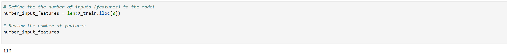  
    * Output Target: 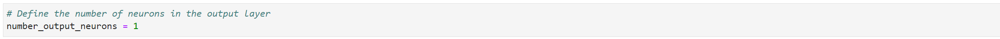  
    * Layer 1 Neurons: 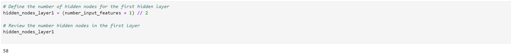  
    * Layer 2 Neurons: 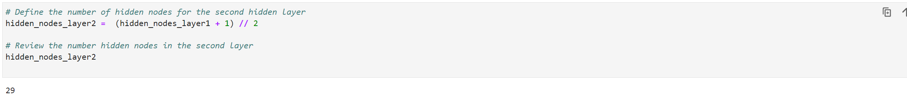  
    * Tensorflow’s Keras Model: 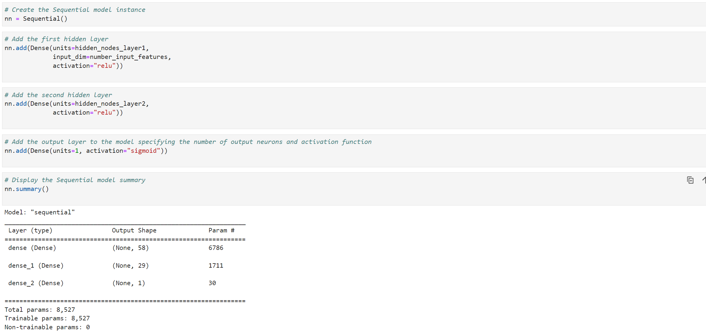  
&nbsp;  
    > **Hint** You can start with a two-layer deep neural network model that uses the `relu` activation function for both layers.
&nbsp;  
2. Compile and fit the model using the `binary_crossentropy` loss function, the `adam` optimizer, and the `accuracy` evaluation metric.
    * Compile and Fit Model: 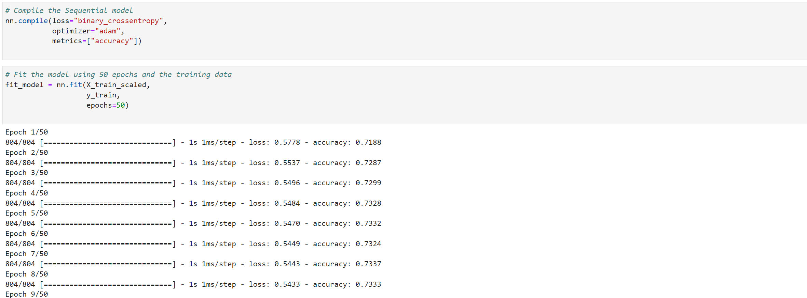  
&nbsp;  
    > **Hint** When fitting the model, start with a small number of epochs, such as 20, 50, or 100.  
&nbsp;  
3. Evaluate the model using the test data to determine the model’s loss and accuracy.
    * Model Results: 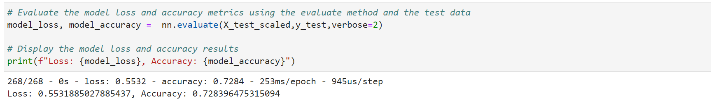  
    * Model Loss: 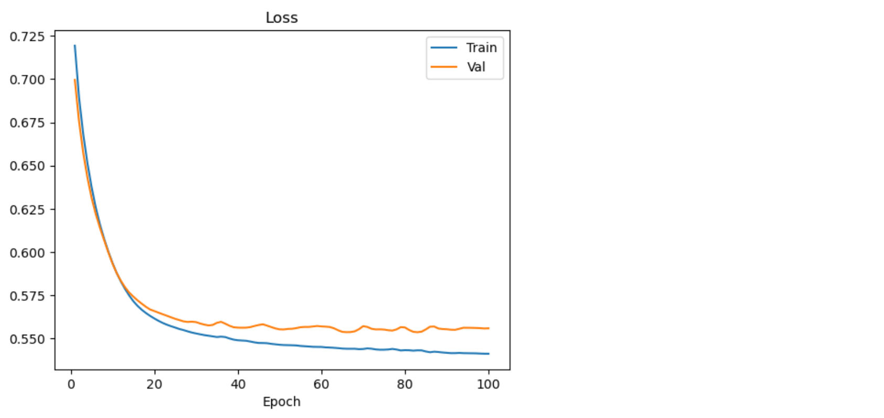  
    * Model Accuracy: 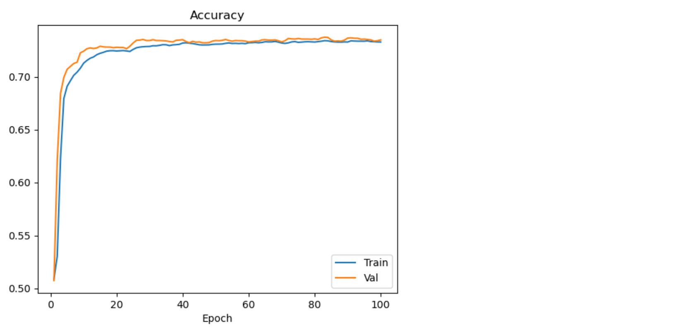  
> **Recomendation:** About 40 epochs apears to be optimal
&nbsp;  
4. Save and export your model to an HDF5 file, and name the file `AlphabetSoup.h5`.
    * HDF5 File: [Origional Model](data/AlphabetSoup.h5)
    * Save an export file: 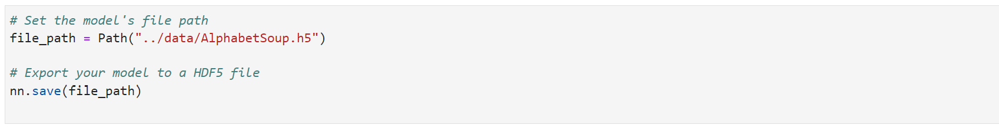  
&nbsp;  
### Step 3: Optimize the Neural Network Model

Using your knowledge of TensorFlow and Keras, optimize your model to improve the model's accuracy. Even if you do not successfully achieve a better accuracy, you'll need to demonstrate at least two attempts to optimize the model. You can include these attempts in your existing notebook. Or, you can make copies of the starter notebook in the same folder, rename them, and code each model optimization in a new notebook.

> **Note** You will not lose points if your model does not achieve a high accuracy, as long as you make at least two attempts to optimize the model.

To do so, complete the following steps:

1. Define at least three new deep neural network models (the original plus 2 optimization attempts). With each, try to improve on your first model’s predictive accuracy.

    > **Rewind** Recall that perfect accuracy has a value of 1, so accuracy improves as its value moves closer to 1. To optimize your model for a predictive accuracy as close to 1 as possible, you can use any or all of the following techniques:
    >
    > * Adjust the input data by dropping different features columns to ensure that no variables or outliers confuse the model.
    >
    > * Add more neurons (nodes) to a hidden layer.
    >
    > * Add more hidden layers.
    >
    > * Use different activation functions for the hidden layers.
    >
    > * Add to or reduce the number of epochs in the training regimen.  
* **Alternate Model 1:**
    1. Moddeling - Additional Hidden Layers
        * Layer 1 has 58 nodes, 1/2 of the features (116) 
        * Dropout layer
        * Layer 2 has 29 nodes, 1/2 of the number nodes in layer 1
        * Layer 3 has 15 nodes, 1/2 of the number nodes in layer 2
&nbsp;  
    
    2. Create a deep neural network by assigning the number of input features, the number of layers, and the number of neurons on each layer using Tensorflow’s Keras.  
        * Model Definition: 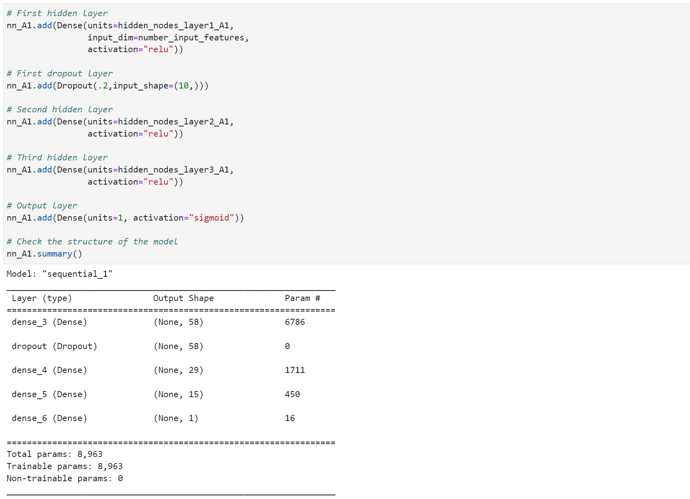  
&nbsp;  
    
    3. Compile and fit the model using the `binary_crossentropy` loss function, the `adam` optimizer, and the `accuracy` evaluation metric.
        * Compile Model: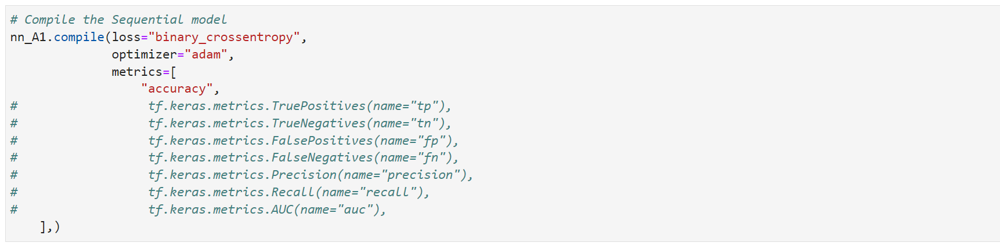 
        * Fit Model: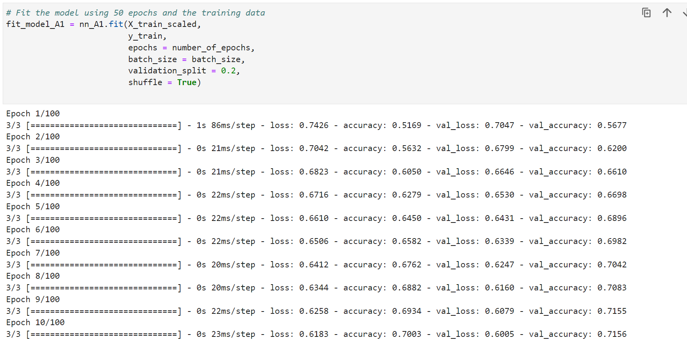 
&nbsp;  
    
    4. Evaluate the model using the test data to determine the model’s loss and accuracy.
        * Model Results: 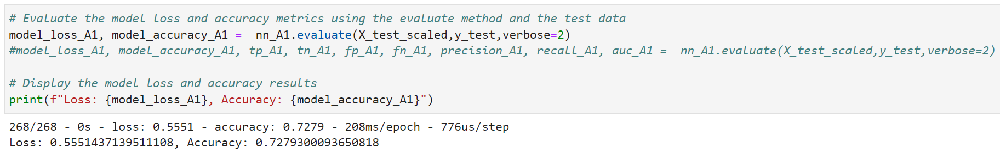  
        * Model Loss: 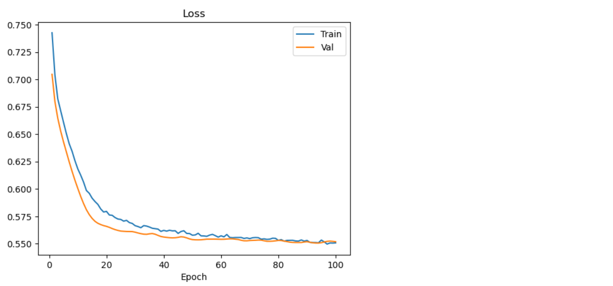  
        * Model Accuracy: 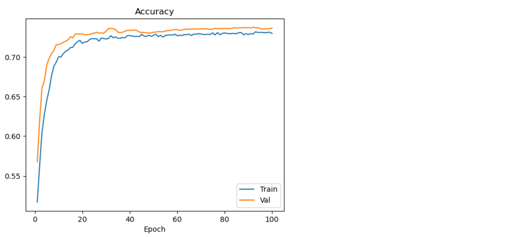  
&nbsp;  
> **Recomendation:** About 50 epochs apears to be optimal
&nbsp;      
    5. Save and export your model to an HDF5 file, and name the file `AlphabetSoup.h5`.
        * HDF5 File: [Alternate Model 1](data/AlphabetSoup_A1.h5)
        * Save an export file: 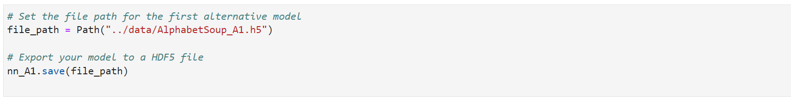  
  

&nbsp;  
* **Alterante Model2:**  
    1. Modeling - Feature Engineering  
        * Target Vatiable `IS_SUCCESSFUL` Variable
            * Balanced - No Action Required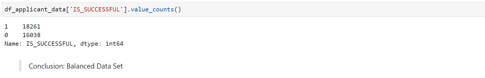
        * Numerical Variables
            * Replace `ASK_AMT` a new categorical variable `Ask_Amt_Group` 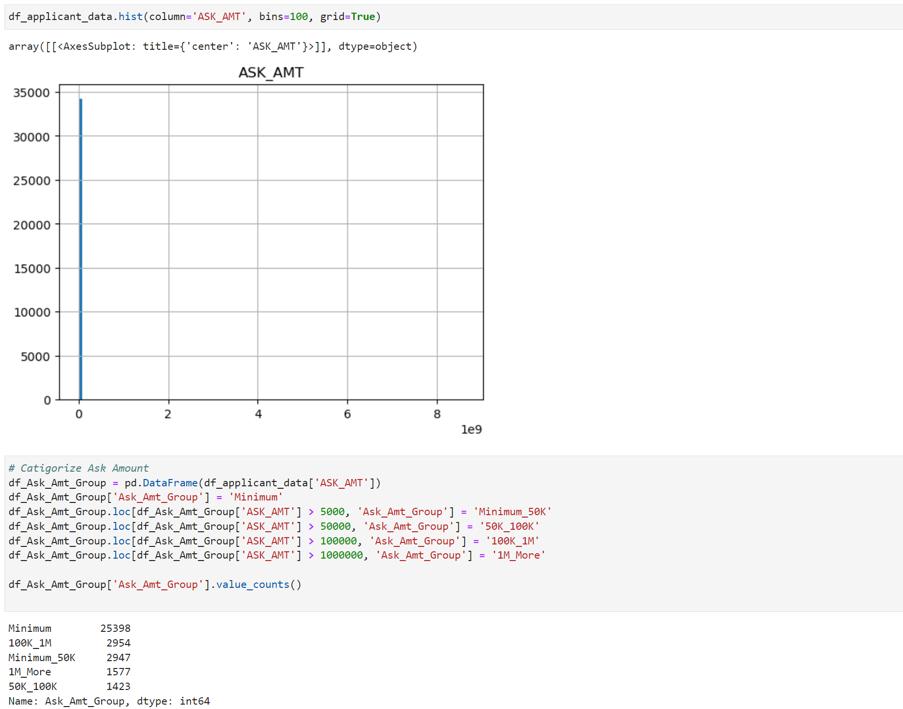  
             * Drop `STATUS` column --> Imbalanced 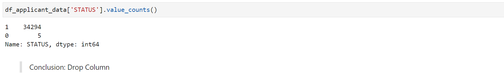  
        * Categorical Variables
            * Run value counts on categorical variables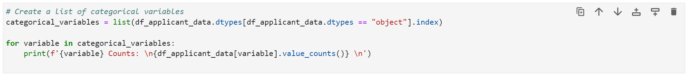
            * Summarize `APPLICATION_TYPE` --> Set Counts < 100 = Other 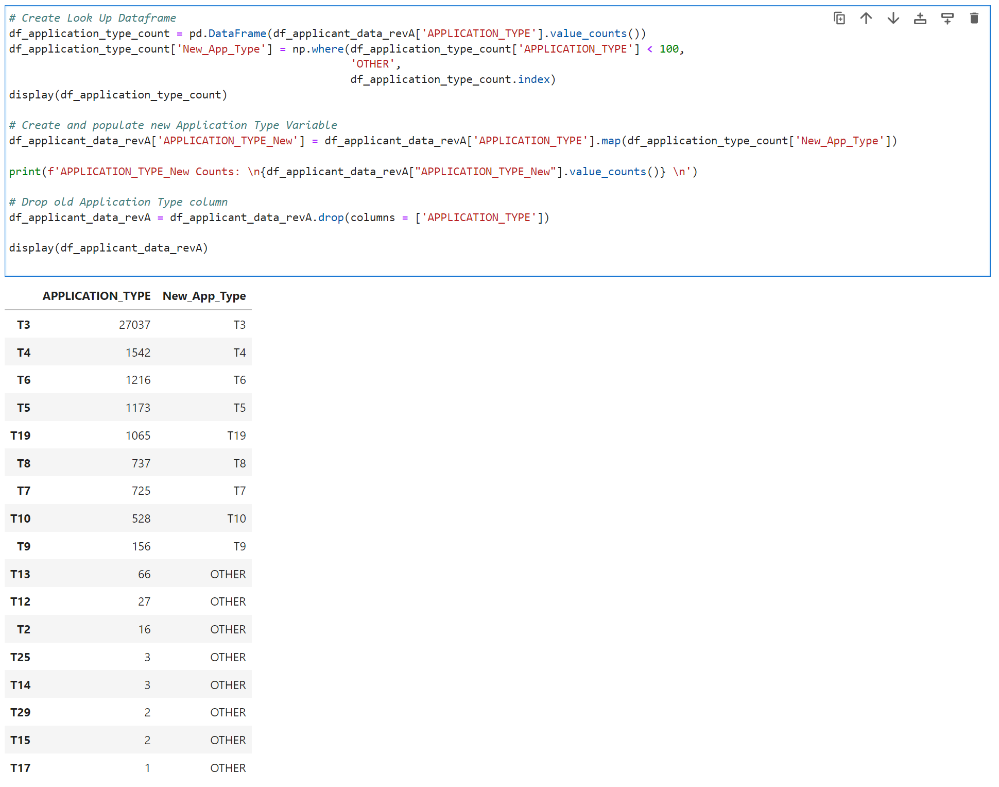  
            * Summarize `AFFILIATION` --> Set Counts < 1000 = Other 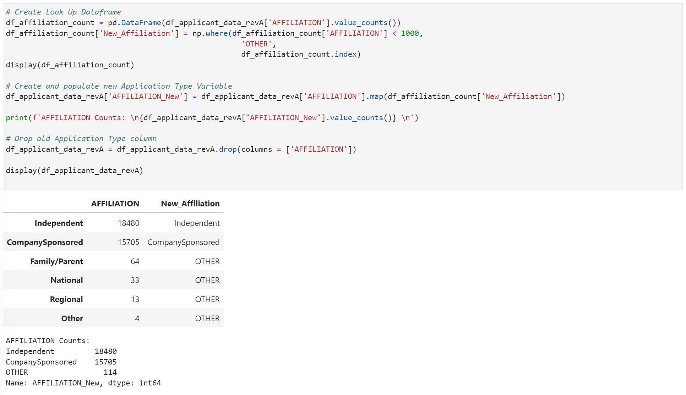  
            * Drop `SPECIAL_CONSIDERATIONS` column --> Imbalanced 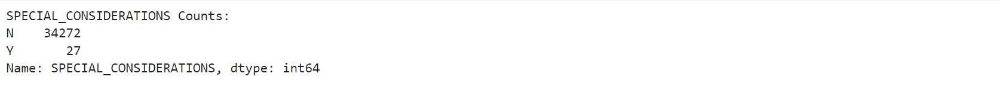  
            * Replace 0 with NONE in `INCOME_AMT` column --> Imbalanced 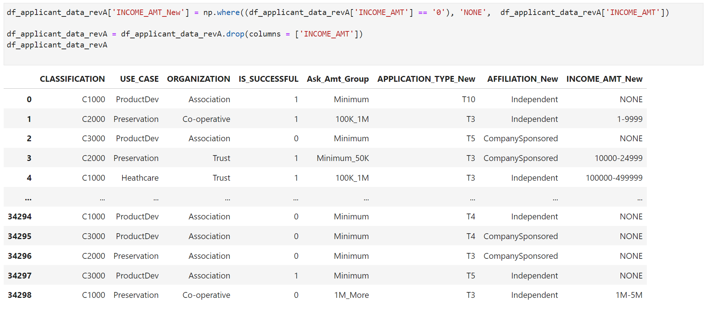  
            * Consolodate `CLASSIFICATION` in a new column --> 1 to 9 counts and 10 to 99 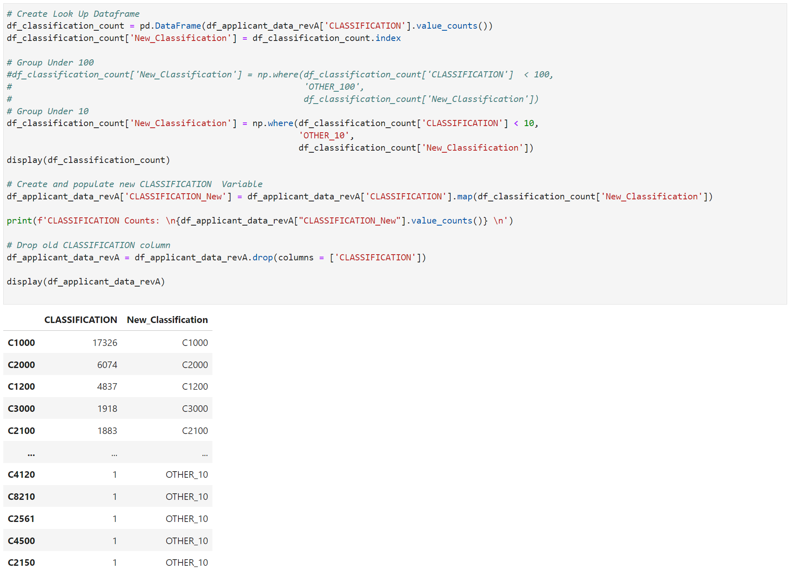  
&nbsp;  
            
    2. Create a deep neural network by assigning the number of input features, the number of layers, and the number of neurons on each layer using Tensorflow’s Keras.  
        * Model Definition: 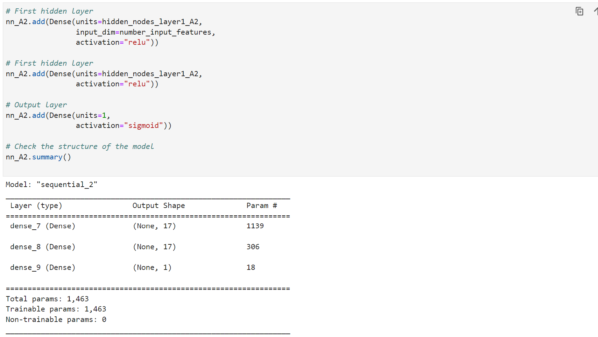  
&nbsp;  
    
    3. Compile and fit the model using the `binary_crossentropy` loss function, the `adam` optimizer, and the `accuracy` evaluation metric.
        * Compile Model: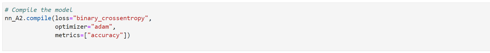 
        * Fit Model: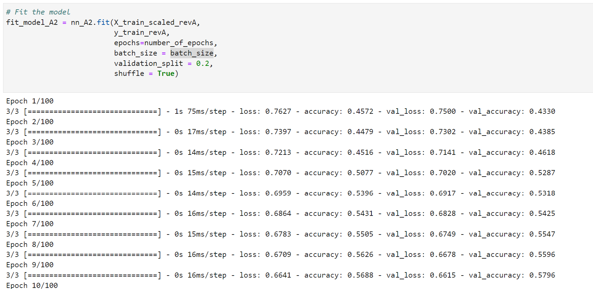 
&nbsp;  

    4. Evaluate the model using the test data to determine the model’s loss and accuracy.
        * Model Results: 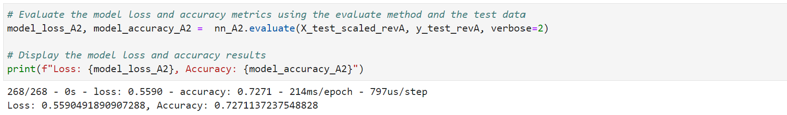  
        * Model Loss: 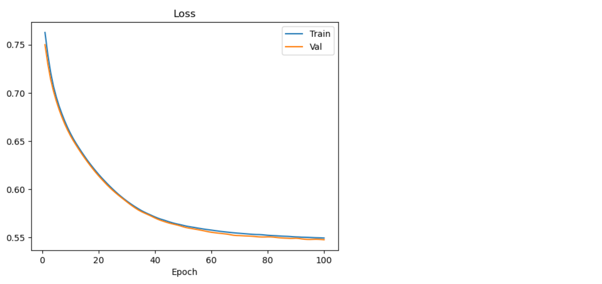  
        * Model Accuracy: 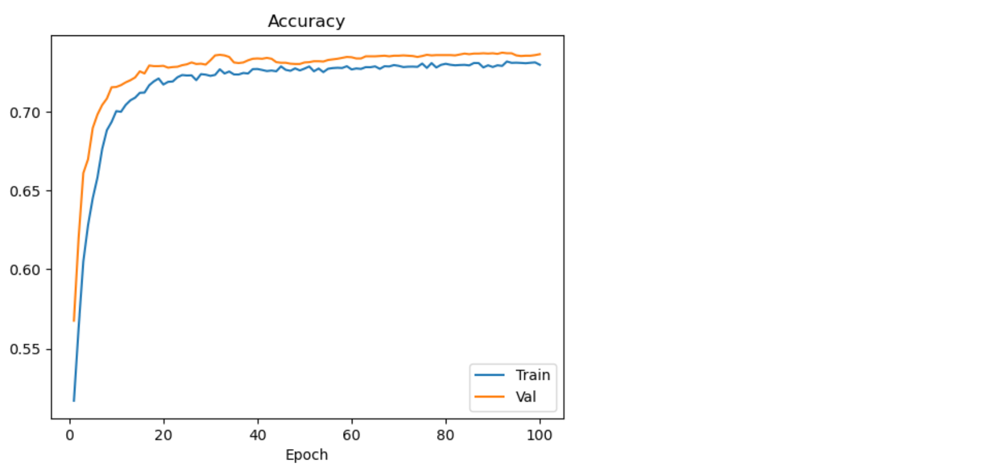  
&nbsp;  
> **Recomendation:** About 50 epochs apears to be optimal
&nbsp;      

    5. Save and export your model to an HDF5 file, and name the file `AlphabetSoup.h5`.
        * HDF5 File: [Alternate Model 1](data/AlphabetSoup_A2.h5)
        * Save an export file: 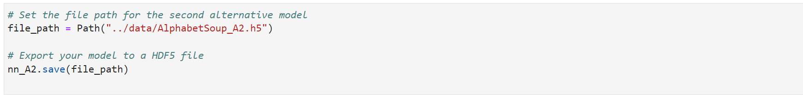  

&nbsp;  

2. After finishing your models, display the accuracy scores achieved by each model, and compare the results.
    * Origional Model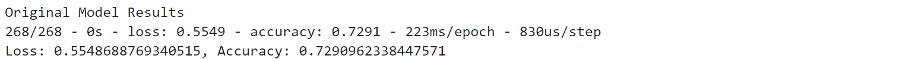  
    * Alternate Model 1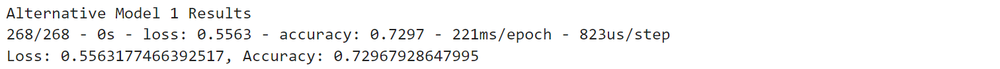  
    * Alternate Model 2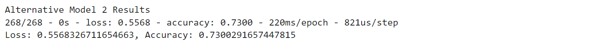  
 &nbsp;  
     
    > Comment: All of the models performed similarly with an accuracy and loss of 0.73 and 0.556. Adding the extral layer added only 436 (5%) more parametes. However, with 7,064 (83%) fewer parameters, the second alterative was the best model. 
&nbsp;  
  
3. Save each of your models as an HDF5 file.
    | Model Link (HDF5) | Numeric Features | Catigorical Encoded | Hidden Layers | Nodes | Parameters |Loss | Accuracy |  
    | ----------------- | ---------------- | ------------------- | ------------- | ----- | -----------|---- | -------- |  
    | [Origional Model](data/AlphabetSoup.h5) | 2 | 114 |  2 | 58, 29 | 8,527 | 0.5532 | 0.7284 |     
    | [Alternate Model 1](data/AlphabetSoup_A1.h5) | 2 | 114 | 3 | 58, 29, 15 | 8,963 | 0.5551 | 0.7279 |  
    | [Alternate Model 2](data/AlphabetSoup_A2.h5) | 0 | 106 | 2 | 53, 27 | 1,463  | 0.5590 | 0.7271 |   
    

   
&nbsp;  
    

---

Copyright 2022 2U. All Rights Reserved.
